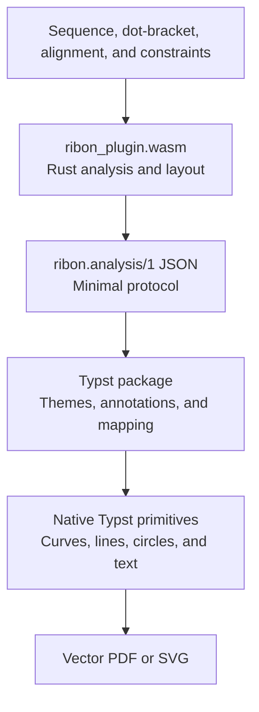

# Architecture

Ribon separates analysis, layout, and rendering behind explicit interfaces.



## Rust core

`ribon-core` has no dependency on Typst. Its principal module boundaries are:

- `energy`, `fold`, and `partition`: RNA, DNA, and custom nearest-neighbor energies; MFE dynamic programming; and inside/outside partition functions
- `constraints`: compilation of hard, soft, and probing inputs into a shared constraint state
- `decode`, `sampling`, `suboptimal`, and `accessibility`: consumers of the thermodynamic ensemble
- `duplex`, `cofold`, `local`, and `circular_standard`: specialized folding grammars
- `extended`, `pseudoknot`, and `comparative`: extended analyses
- `naview`, `turtle`, `puzzler`, and `layout`: coordinate generation and normalization
- `parameters`: model identifiers, versions, licenses, and SHA-256 metadata

At build time, `build.rs` parses the RNA and DNA parameter families separately and generates Rust tables in centi-kcal/mol. It maps source pair and mismatch axes to the closing-pair orientation used at runtime and rejects missing values, invalid dimensions, and incorrect row counts. Custom normalized overlays are checked against the same dimensional contract immediately after request decoding. The runtime performs no filesystem I/O.

## WASM protocol

`ribon-plugin` exposes one function:

```text
run(request-json-bytes) -> response-json-bytes
```

A request contains `schema_version: 1`, `operation`, `input`, `model`, `constraints`, `options`, `execution`, and an optional `id`. Every response uses an envelope: successful responses contain `result.kind` and `result.data`, while failures contain a stable `error.code` and a message. Serde's `deny_unknown_fields` rejects fields outside the protocol schema.

The WASM module imports no process, network, filesystem, clock, or randomness facility. Sampling uses a deterministic pseudorandom stream derived from the seed supplied in the request.

## Typst renderer

The Typst package does not recompute energies. Its modules consume sequences, structures, probabilities, and unitless layout coordinates from a response, then emit native primitives in a deterministic layer order: regions, backbone, base-pair edges, coaxial annotations, nucleotides, numbering, and labels. `package/lib.typ` is the stable public entry point; implementation modules are separated by responsibility under `package/src/`.

`render(response, which:)` validates the result kind and connects MFE, centroid, and MEA structures from analysis, circular, and comparative results, as well as duplex, cofold, modified-base, G-quadruplex, and pseudoknot results. `draw` renders supplied dot-bracket notation directly or renders the result of one `analyze` call.

## Complexity and safeguards

| Operation | Time | Memory |
|---|---:|---:|
| Global MFE or partition function | Cubic in sequence length | Quadratic in sequence length |
| Odd-dangle partition function and consumers | Proportional to the number of planar structures | Enumeration stack plus probability table |
| Full cofold with dangles 0 or 2 | Cubic in total length plus a term quadratic in both total and maximum strand length | Quadratic in total length |
| Full cofold with dangles 1 or 3 | Proportional to the number of two-strand planar structures | Enumeration stack plus probability table |
| Suboptimal k-best search | Depends on output count and energy band | Dynamic-programming tables plus heap |
| Local windows | Number of windows multiplied by the window partition-function cost | Quadratic in window length per window |
| Circular root grammar | Cubic in sequence length | Quadratic in sequence length |
| Exact landscape path | All planar states plus explicit graph search | All states and all single-pair-move edges |
| Exact inverse folding | All template-compatible sequences, each evaluated by thermodynamic dynamic programming | Ranked output plus one sequence-level dynamic-programming workspace |
| Exact ligand ensemble | All planar RNA structures combined with all compatible-site independent sets | Quadratic marginals plus enumeration stack |
| H-type core generation | All sequence-compatible pairs of contiguous helices | Core list plus pair maps |
| Span-disjoint H-type ensemble | Proportional to the product of core count and maximum independent-component count | The same product order |
| Simple, circular, or linear layout | Linear in nucleotide plus pair count | Linear in nucleotide plus pair count |

Document-time execution has explicit default limits, including 500 nt for global analysis, 20,000 nt for layout, 5,000 nt with 200 nt windows for local analysis, 400 total nucleotides and a 40,000 length product for duplex analysis, 2,000 samples, and 500 suboptimal outputs. Exact arbitrary matching, landscape analysis, inverse design, and ligand analysis use additional limits based on their state spaces. Exceeding a limit returns the stable `resource_limit` error. A caller who has assessed the input may set `execution.allow_expensive: true`; doing so removes the safeguard without changing the grammar, energy model, decoder, or exactness of the selected operation.

## Reproducibility

- Rust dependencies are locked by `Cargo.lock`.
- Thermodynamic models are identified as `ribon-turner-2004`, `ribon-mathews-dna-2004`, or the fingerprinted `ribon-custom-thermodynamic-v1`.
- Source archives and normalized parameter bundles are pinned by SHA-256.
- Stochastic operations are fixed by a request-level seed.
- Visual goldens record the Typst and Poppler versions, rasterization resolution, and per-page SHA-256 hashes.
- External reference programs remain outside the runtime, and each differential report records its program version, artifact hash, and tolerances.
